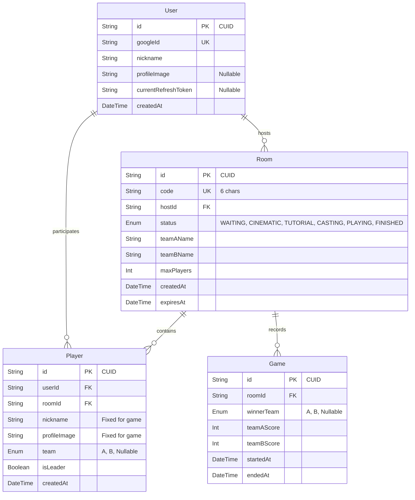

# Database Specification

## Overview

본 프로젝트는 두 가지 데이터 저장소를 사용합니다:

| 저장소 | 용도 | 데이터 특성 |
|--------|------|-------------|
| **PostgreSQL** | 영구 데이터 저장 | 사용자 정보, 게임 결과, 방 정보 |
| **Redis** | 실시간 임시 데이터 | 게임 진행 중 점수, 플레이어 상태(준비/센서 등) |

---

## PostgreSQL Schema

### ERD (Entity Relationship Diagram)



---

### User (사용자)

Google Auth와 연동되는 사용자 정보를 저장합니다.

| Column | Type | Constraints | Description |
|--------|------|-------------|-------------|
| `id` | `String` | PK, CUID | 고유 식별자 |
| `googleId` | `String` | UNIQUE, NOT NULL | Google 사용자 UID |
| `nickname` | `String` | NOT NULL | 닉네임 (사용자 설정) |
| `profileImage` | `String?` | NULLABLE | 프로필 이미지 URL |
| `currentRefreshToken` | `String?` | NULLABLE | JWT Refresh Token (Hashed) |
| `createdAt` | `DateTime` | NOT NULL, DEFAULT NOW | 가입 일시 |

**Relations:**
- `players`: 참여한 게임 방 목록 (1:N)
- `hostedRooms`: 호스트한 방 목록 (1:N)

---

### Room (게임 방)

게임 방 정보를 저장합니다. QR 코드 입장에 사용되는 `code`는 6자리 영숫자입니다.

| Column | Type | Constraints | Description |
|--------|------|-------------|-------------|
| `id` | `String` | PK, CUID | 고유 식별자 |
| `code` | `String` | UNIQUE, NOT NULL | 6자리 입장 코드 (QR용) |
| `hostId` | `String` | FK → User.id | 방장 사용자 ID |
| `status` | `RoomStatus` | NOT NULL, DEFAULT 'WAITING' | 방 상태 |
| `teamAName` | `String` | NOT NULL, DEFAULT 'A팀' | A팀 이름 (호스트 지정) |
| `teamBName` | `String` | NOT NULL, DEFAULT 'B팀' | B팀 이름 (호스트 지정) |
| `maxPlayers` | `Int` | NOT NULL, DEFAULT 10 | 방 최대 인원수 |
| `createdAt` | `DateTime` | NOT NULL, DEFAULT NOW | 생성 일시 |
| `expiresAt` | `DateTime` | NOT NULL | 만료 일시 |

**RoomStatus Enum:**

| Status | 설명 |
|--------|------|
| `WAITING` | 대기 중 (입장 가능) |
| `CINEMATIC` | 시네마틱 영상 재생 중 |
| `TUTORIAL` | 튜토리얼 및 센서 확인 중 |
| `CASTING` | 캐스팅 진행 중 |
| `PLAYING` | 게임 진행 중 |
| `FINISHED` | 게임 종료 |

**Relations:**
- `host`: 방장 User (N:1)
- `players`: 참가자 목록 (1:N)
- `games`: 게임 결과 목록 (1:N)

---

### Player (방 참가자)

방에 참여한 플레이어 정보입니다. 게임 진행 중 닉네임 변경 등에 영향을 받지 않도록 입장 시점의 정보를 저장합니다.

| Column | Type | Constraints | Description |
|--------|------|-------------|-------------|
| `id` | `String` | PK, CUID | 고유 식별자 |
| `userId` | `String` | FK → User.id | 사용자 ID |
| `roomId` | `String` | FK → Room.id, CASCADE | 방 ID |
| `nickname` | `String` | NOT NULL | 게임 내 표시 닉네임 (입장 시 고정) |
| `profileImage` | `String?` | NULLABLE | 게임 내 프로필 이미지 (입장 시 고정) |
| `team` | `Team?` | NULLABLE | 소속 팀 (null = 미배정) |
| `isLeader` | `Boolean` | NOT NULL, DEFAULT false | 팀장 여부 |
| `createdAt` | `DateTime` | NOT NULL, DEFAULT NOW | 입장 일시 |

**Team Enum:**
- `A`, `B`

**Unique Constraint:**
- `@@unique([userId, roomId])` - 한 방에 같은 유저 중복 참가 방지

---

### Game (게임 결과)

완료된 게임의 결과를 저장합니다.

| Column | Type | Constraints | Description |
|--------|------|-------------|-------------|
| `id` | `String` | PK, CUID | 고유 식별자 |
| `roomId` | `String` | FK → Room.id, CASCADE | 방 ID |
| `winnerTeam` | `Team?` | NULLABLE | 승리 팀 (null = 무승부) |
| `teamAScore` | `Int` | NOT NULL, DEFAULT 0 | A팀 최종 점수 |
| `teamBScore` | `Int` | NOT NULL, DEFAULT 0 | B팀 최종 점수 |
| `startedAt` | `DateTime` | NOT NULL | 게임 시작 일시 |
| `endedAt` | `DateTime` | NOT NULL | 게임 종료 일시 |

---

## Redis Data Structure

Redis는 게임 중 실시간으로 변하는 데이터를 저장합니다.

### Key Naming Convention

```
room:{roomId}                    → 방 전체 상태 (Hash)
room:{roomId}:player:{playerId}  → 플레이어별 상태 (Hash)
```

### Room State (`room:{roomId}`)

| Field | Type | Description |
|-------|------|-------------|
| `score:A` | `Int` | A팀 현재 점수 |
| `score:B` | `Int` | B팀 현재 점수 |
| `goalScore` | `Int` | 게임 목표 점수 |
| `leader:A` | `String` | A팀 리더 Player ID |
| `leader:B` | `String` | B팀 리더 Player ID |

### Player State (`room:{roomId}:player:{playerId}`)

| Field | Type | Description |
|-------|------|-------------|
| `isReady` | `0` \| `1` | 준비 완료 여부 |
| `sensorChecked` | `0` \| `1` | 센서 확인 완료 여부 |
| `isLeader` | `0` \| `1` | 팀장 여부 |
| `score` | `Int` | 개인 기여 점수 |
